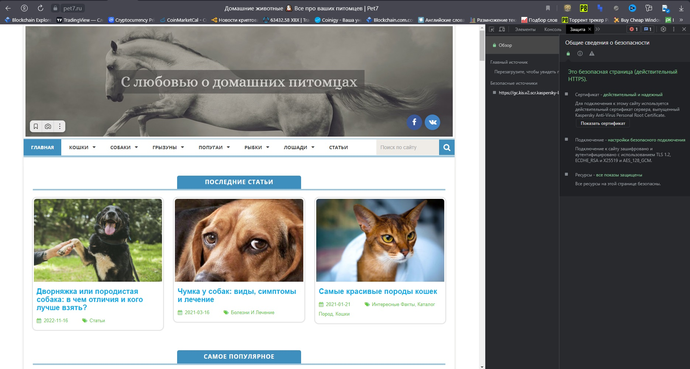
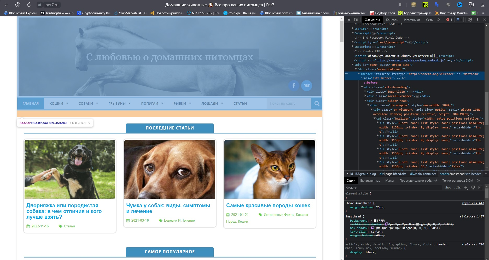
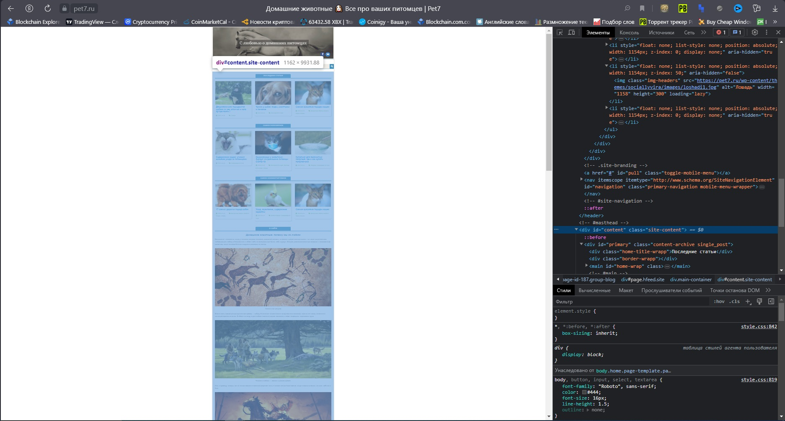
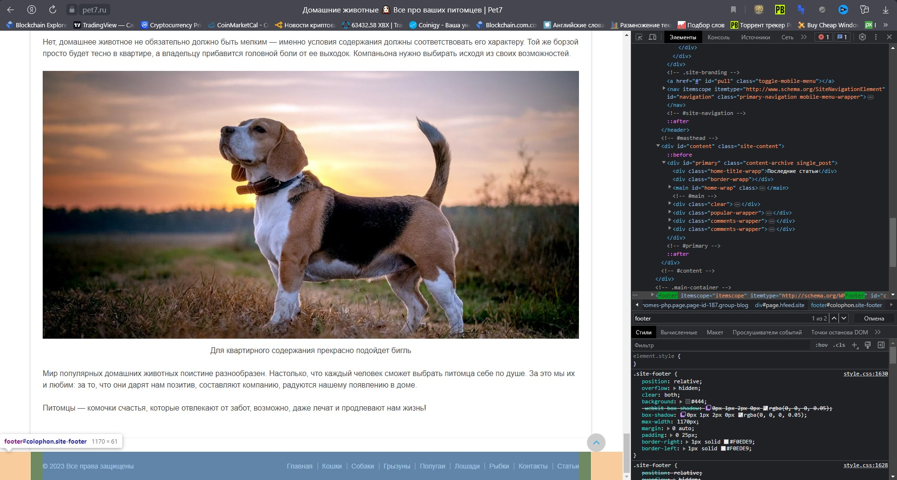

# Знакомство с веб-технологиями

Задача: на основе сайта https://pet7.ru/
- Определите, на каком протоколе работает сайт.
- Проанализируйте структуру страницы сайта. Покажите в коде header footer и content
- Внесите не менее 3 изменений на страницу с помощью инструмента разработчика и представьте скриншоты было/стало.
- Создайте прототип низкой детализации.

## На каком протоколе работает сайт:
Сайт работает на протоколе HTTPS.

## Проанализируйте структуру страницы сайта. Покажите в коде header footer и content:

Сайт имеет “классическую” структуру, состоящий из header, content и footer.

Анализ кода показал также применение CSS и скриптов.

## Внесите не менее 3 изменений на страницу с помощью инструмента разработчика и представьте скриншоты было/стало:
